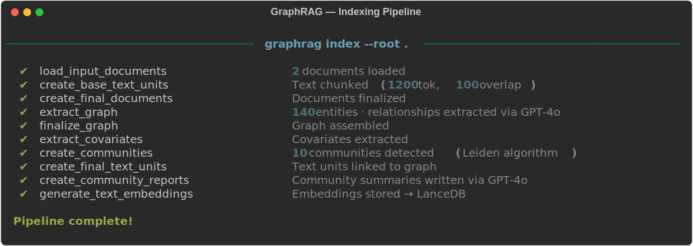
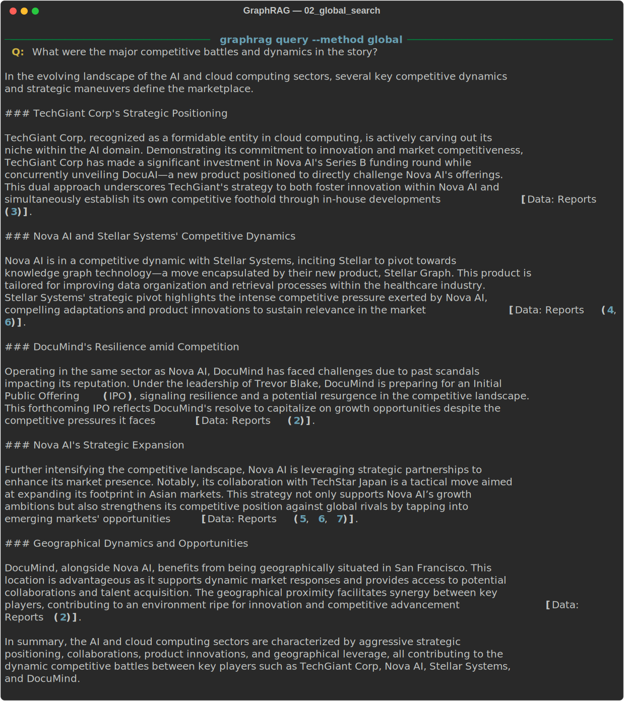
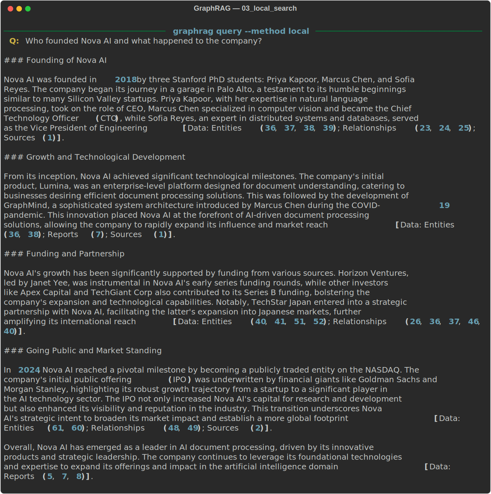

# GraphRAG Tutorial — From Zero to Knowledge Graph

> A hands-on, illustrated guide to [Microsoft GraphRAG](https://github.com/microsoft/graphrag).
> No prior graph database knowledge needed.

---

## Table of Contents

1. [What Problem Does GraphRAG Solve?](#1-what-problem-does-graphrag-solve)
2. [How GraphRAG Works — A Visual Tour](#2-how-graphrag-works--a-visual-tour)
3. [Setup](#3-setup)
4. [Run Your First Index](#4-run-your-first-index)
5. [Query the Knowledge Graph](#5-query-the-knowledge-graph)
6. [Visualizing the Graph](#6-visualizing-the-graph)
7. [Understanding the Output Files](#7-understanding-the-output-files)
8. [Local vs Global Search — When to Use Which](#8-local-vs-global-search--when-to-use-which)
9. [Configuration Guide](#9-configuration-guide)
10. [Add Your Own Documents](#10-add-your-own-documents)
11. [Resources](#11-resources)

---

## 1. What Problem Does GraphRAG Solve?

### The Classic RAG Problem

Standard RAG (Retrieval-Augmented Generation) works by converting your documents
into floating-point vectors and doing a similarity search when you ask a question.
Think of it as a very smart Ctrl+F.

```
YOUR QUESTION
     |
     v
 [Find the 3 chunks most similar to your question]
     |
     v
 [Paste those chunks into the LLM prompt]
     |
     v
 ANSWER (based only on those 3 chunks)
```

This works great for **specific, local questions** like:
- "What does the refund policy say?"
- "What is the boiling point of water?"

But it **breaks down** for questions that require connecting dots across many documents:

```
Question: "What competitive dynamics shaped the AI document industry?"

Classic RAG finds:
  Chunk A (from page 2):  "Nova AI was founded in 2018..."
  Chunk B (from page 7):  "DocuMind raised $40 million..."
  Chunk C (from page 15): "The IPO raised $420 million..."

Problem: These chunks are ISOLATED ISLANDS.
         The LLM has no idea how Nova AI and DocuMind are related,
         who competed with whom, or what events connected them.
```

### The GraphRAG Solution

GraphRAG reads all your documents and builds a **knowledge graph** — a web of
entities (people, companies, events) connected by relationships.

```
                     ┌─────────────────────┐
                     │      DOCUMENTS       │
                     └──────────┬──────────┘
                                │ GraphRAG reads
                                │ & understands
                                ▼
        ┌───────────────────────────────────────────┐
        │              KNOWLEDGE GRAPH               │
        │                                            │
        │   [Nova AI]──FOUNDED_BY──[Priya Kapoor]   │
        │       │                       │            │
        │  COMPETED_WITH           PITCHED_TO        │
        │       │                       │            │
        │   [DocuMind]           [Horizon Ventures]  │
        │       │                       │            │
        │  ACQUIRED──[SearchPro]   LED_BY──[Janet]  │
        │                                            │
        └───────────────────────────────────────────┘
                                │
                                │ When you ask a question,
                                │ GraphRAG traverses these
                                │ connections intelligently
                                ▼
                     ┌─────────────────────┐
                     │   RICH, CONNECTED   │
                     │       ANSWER        │
                     └─────────────────────┘
```

**The analogy:** Classic RAG is like reading random pages from a book.
GraphRAG is like having a brilliant research assistant who has read the whole book,
built a mind-map of everything, and can explain how all the pieces fit together.

---

## 2. How GraphRAG Works — A Visual Tour

GraphRAG runs a **pipeline** of steps. Here is what happens under the hood:

```
┌──────────────────────────────────────────────────────────────────────┐
│                     THE GRAPHRAG PIPELINE                            │
│                                                                      │
│  STEP 1: CHUNK                                                       │
│  ─────────────                                                       │
│  Big documents → smaller text chunks (300 tokens each, 100 overlap)  │
│                                                                      │
│  "Nova AI was founded  │  "Marcus presented the  │  "The IPO raised  │
│   in 2018 by Priya..." │   GraphMind paper at..." │   $420 million..."│
│                                                                      │
│                         ↓                                            │
│  STEP 2: ENTITY EXTRACTION (via LLM)                                 │
│  ─────────────────────────────────                                   │
│  Each chunk → LLM finds entities and relationships                   │
│                                                                      │
│  Person: Priya Kapoor (CEO of Nova AI)                               │
│  Org:    Nova AI (AI startup, founded 2018)                          │
│  Org:    Horizon Ventures (venture capital firm)                     │
│  Event:  Series A ($12M, 2019)                                       │
│  Rel:    Priya FOUNDED Nova AI                                       │
│  Rel:    Horizon Ventures INVESTED_IN Nova AI                        │
│                                                                      │
│                         ↓                                            │
│  STEP 3: BUILD KNOWLEDGE GRAPH                                       │
│  ────────────────────────────                                        │
│  All extracted entities & relationships → one big connected graph    │
│  Duplicate entities (e.g. "Nova AI" appearing in 20 chunks) → merged │
│                                                                      │
│                         ↓                                            │
│  STEP 4: COMMUNITY DETECTION (Leiden algorithm)                      │
│  ─────────────────────────────────────────────                       │
│  Nodes that are tightly connected → grouped into "communities"       │
│                                                                      │
│  Community A: Nova AI ecosystem                                      │
│    (Nova AI, Priya, Marcus, Sofia, Horizon Ventures, DataBridge...)  │
│                                                                      │
│  Community B: DocuMind ecosystem                                     │
│    (DocuMind, Trevor Blake, SearchPro, Cognify...)                   │
│                                                                      │
│  Community C: Healthcare AI                                          │
│    (Stellar Systems, Leila Nouri, MedReader, HealthTech Partners...) │
│                                                                      │
│                         ↓                                            │
│  STEP 5: SUMMARIZE COMMUNITIES (via LLM)                             │
│  ───────────────────────────────────────                             │
│  Each community → LLM writes a rich summary paragraph               │
│  These summaries power Global Search queries later                   │
│                                                                      │
│                         ↓                                            │
│  STEP 6: EMBED EVERYTHING                                            │
│  ────────────────────────                                            │
│  Entities, relationships, summaries → vector embeddings stored       │
│  These power Local Search queries later                              │
│                                                                      │
└──────────────────────────────────────────────────────────────────────┘
```

This whole process (steps 1–6) is called **indexing**. You run it once.
After that, querying is fast.

---

## 3. Setup

### Prerequisites

- Python 3.10 or 3.11
- An OpenAI API key (get one at [platform.openai.com](https://platform.openai.com))
- ~$0.50–$2.00 in OpenAI credits for the sample document

### Step-by-step

**Step 1 — Clone / open the repo**

```bash
cd graph-rag   # you're already here
```

**Step 2 — Create a virtual environment**

```bash
python -m venv .venv

# Activate it:
source .venv/bin/activate        # macOS / Linux
.venv\Scripts\activate           # Windows PowerShell
```

You should see `(.venv)` appear in your terminal prompt.

**Step 3 — Install dependencies**

```bash
pip install -r requirements.txt
```

This installs `graphrag` (Microsoft's library) and `python-dotenv`.

**Step 4 — Set your API key**

```bash
cp .env.example .env
```

Open `.env` in any text editor and replace the placeholder:

```
# Before:
GRAPHRAG_API_KEY=sk-...your-openai-api-key-here...

# After (your real key):
GRAPHRAG_API_KEY=sk-proj-abc123...
```

> Never commit your `.env` file — it's already in `.gitignore`.

**Step 5 — Initialize GraphRAG prompts**

```bash
python -m graphrag.index --init --root .
```

This creates a `prompts/` folder with the default LLM prompts that GraphRAG
uses for entity extraction, community summarization, etc. You can customize
these later, but the defaults work great.

```
graph-rag/
├── prompts/                 ← NEW: created by --init
│   ├── entity_extraction.txt
│   ├── summarize_descriptions.txt
│   └── community_report.txt
```

---

## 4. Run Your First Index

The `input/` folder already contains a sample story — **Silicon Valley Chronicles**,
a fictional narrative about AI startups, founders, investors, and competitive
battles. It's deliberately rich in entities and relationships so you can see
GraphRAG's power clearly.

```
graph-rag/
└── input/
    └── silicon_valley_chronicles.txt   ← 10-chapter story, full of entities
```

**Run the indexing pipeline:**

```bash
python -m graphrag.index --root .
```

You'll see progress logs like this:

```
⠹ GraphRAG Indexer
├── Loading Input (text)                  ✓
├── Chunking                              ✓
├── Extracting Entities                   ✓  (calls GPT-4o for each chunk)
├── Summarizing Descriptions              ✓  (merges duplicate entities)
├── Building Knowledge Graph              ✓
├── Detecting Communities (Leiden)        ✓
├── Generating Community Reports          ✓  (calls GPT-4o per community)
└── Embedding Everything                  ✓
```



> **How long does it take?**
> For the sample document: roughly 3–8 minutes.
> For large corpora (hundreds of documents): can be 30–60 minutes.
> The cache (in `cache/`) means re-runs skip already-processed chunks.

When finished, you'll see an `output/` directory appear:

```
output/
└── 20240516-143022/          ← timestamped run
    ├── artifacts/            ← parquet files (the actual graph data)
    └── reports/              ← indexing run logs
```

---

## 5. Query the Knowledge Graph

Once indexing finishes, you can ask questions. Use `query.py` (a simple wrapper)
or the GraphRAG CLI directly.

### Using query.py

```bash
# Specific question about a person or company (local search):
python query.py "Who founded Nova AI and what were their backgrounds?" --method local

# Broad thematic question (global search):
python query.py "What were the major competitive dynamics in the AI industry?"

# More examples:
python query.py "What happened during the DocuMind security crisis?" --method local
python query.py "How did the COVID pandemic affect the companies?" --method local
python query.py "What are the key themes across this story?" --method global
```

### Using the GraphRAG CLI directly

```bash
python -m graphrag.query --root . --method local  "Tell me about Priya Kapoor"
python -m graphrag.query --root . --method global "Summarize the major events"
```

### Sample question and answer

```
Question: "How did Nova AI grow from a startup to a public company?"
Method:   local

Answer:
  Nova AI was founded in 2018 by Priya Kapoor, Marcus Chen, and Sofia Reyes
  in a Palo Alto garage. Their initial product, Lumina, secured a $12M Series A
  from Horizon Ventures in 2019. A COVID-era pivot led Marcus Chen to design
  GraphMind — a knowledge-graph architecture that differentiated them from
  competitors. This attracted a $35M Series B from Horizon Ventures, Apex Capital,
  and TechGiant Corp. Through strategic acquisitions (DataBridge), partnerships
  (CloudBase), and capitalizing on rival DocuMind's 2022 security scandal, Nova AI
  grew to 400 employees and $180M ARR before going public on NASDAQ in February
  2024, raising $420M at $28/share.
```

Notice how the answer **connects information from across all 10 chapters**
of the story — something classic RAG would struggle with.

**Global search** — thematic question across the whole corpus:



**Local search** — specific question about a named entity:



---

## 6. Visualizing the Graph

After indexing, you have three options for seeing the graph visually.
They go from "easiest" to "most powerful":

```
┌──────────────────────────────────────────────────────────────────────┐
│  OPTION A — Interactive HTML (easiest, works in any browser)         │
│  OPTION B — Gephi desktop app (best for large, complex graphs)       │
│  OPTION C — Neo4j Browser (best for running graph queries visually)  │
└──────────────────────────────────────────────────────────────────────┘
```

---

### Option A — Interactive HTML with `visualize.py` (recommended for beginners)

This generates a single `graph.html` file you open in Chrome/Firefox/Safari.
No extra software needed beyond `pip install`.

```bash
# Install the visualization library (one-time):
pip install pyvis

# Generate the interactive graph:
python visualize.py
```

Then open `graph.html` in your browser. You'll see something like this:

```
  ┌────────────────────────────────────────────────────────┐
  │  graph.html (in your browser)                          │
  │                                                        │
  │   ●━━━━━━━━━━━━━━━━━━━━━━━━━━━━━━━━━━━━━━━━━●         │
  │  Nova AI              COMPETED_WITH        DocuMind    │
  │   ║  ╲                                    ╱   ║        │
  │   ║   ╲                                  ╱    ║        │
  │  FOUNDED  ╲                            ╱  ACQUIRED     │
  │   ║        ●━━━━━━━━━━━━━━━━━━━━━━━━━━●        ║       │
  │  Priya  Horizon Ventures       SearchPro   Trevor      │
  │  Kapoor    (teal cluster)      (grey)      Blake       │
  │                                                        │
  │  [Hover any node → see its description]               │
  │  [Drag → rearrange]   [Scroll → zoom]                 │
  └────────────────────────────────────────────────────────┘

  Node COLOR  = which community it belongs to (related entities cluster together)
  Node SIZE   = how many connections (bigger = more important hub)
  Edge WIDTH  = relationship strength (thicker = stronger link)
```

**Useful flags:**

```bash
# Too many nodes? Keep only the 50 most-connected ones:
python visualize.py --max-nodes 50

# Zoom into just one community (use 0, 1, 2, ...):
python visualize.py --community 0

# Color by entity type instead of community:
python visualize.py --color type

# Save to a custom filename:
python visualize.py --output nova_ai_graph.html

# Open directly (macOS):
python visualize.py && open graph.html
```

**What the colors mean with `--color type`:**

```
  ██ Teal   (#4ECDC4) = Organization  (companies, firms, institutions)
  ██ Red    (#FF6B6B) = Person         (founders, executives, researchers)
  ██ Mint   (#95E1D3) = Geo            (cities, countries, regions)
  ██ Yellow (#F7DC6F) = Event          (IPOs, acquisitions, conferences)
  ██ Purple (#BB8FCE) = Technology     (software, models, architectures)
  ██ Amber  (#F0A500) = Product        (commercial products and platforms)
```

---

### Option B — Gephi (desktop app, best for large graphs)

[Gephi](https://gephi.org) is free, open-source, and purpose-built for graph
exploration. It handles thousands of nodes smoothly and has built-in layout
algorithms, community coloring, and filtering tools.

**Step 1 — Enable GraphML export** (already done in this repo's `settings.yml`):

```yaml
snapshots:
  graphml: true    # ← this is already set to true
```

**Step 2 — Re-run indexing** to generate the `.graphml` file:

```bash
python -m graphrag.index --root .
# After it finishes:
ls output/*/artifacts/*.graphml
```

**Step 3 — Open in Gephi:**

```
1. Download Gephi from https://gephi.org/users/download/
2. File → Open → select the .graphml file
3. Run a layout:
   Layout panel (bottom-left) → choose "ForceAtlas 2" → click Run
   Wait 10-20 seconds, then click Stop
4. Color by community:
   Appearance panel → Nodes → Color → Partition → community
5. Size by degree:
   Appearance panel → Nodes → Size → Ranking → Degree
```

```
  What Gephi looks like after layout + coloring:

  ┌─────────────────────────────────────────────────────────┐
  │                                                         │
  │  ●●●●●           ●●●     ●●●●●●●●●                     │
  │ ●●●●●●●     ●●●●●●●●●    ●●●●●●●●●●●                   │
  │  ●●●●●●     ●●●●●●●●     ●●●●●●●●●●                    │
  │  (blue      (green       (red cluster)                  │
  │   cluster:  cluster:     Healthcare AI)                 │
  │   Nova AI)  DocuMind)                                   │
  │                                                         │
  │  Each cluster = one community detected by GraphRAG      │
  │  Edges between clusters = cross-community connections   │
  └─────────────────────────────────────────────────────────┘
```

---

### Option C — Explore the graph with Python + pandas

No GUI needed — just look at the raw data in a Jupyter notebook or script:

```python
import pandas as pd

# Find your latest run:
import pathlib
artifacts = sorted(pathlib.Path("output").iterdir(), reverse=True)[0] / "artifacts"

# Load the graph
nodes = pd.read_parquet(artifacts / "create_final_nodes.parquet")
edges = pd.read_parquet(artifacts / "create_final_relationships.parquet")

# Print all entities and their types
print(nodes[["title", "type", "description"]].to_string())

# Print all relationships
print(edges[["source", "target", "description"]].to_string())

# Show the 10 most-connected entities (the graph "hubs")
degree = pd.concat([edges["source"], edges["target"]]).value_counts()
print("Top 10 most-connected entities:")
print(degree.head(10))

# Show community membership
print(nodes.groupby("community")["title"].apply(list))
```

---

## 7. Understanding the Output Files

After indexing, `output/<timestamp>/artifacts/` contains several `.parquet` files.
Here's what each one contains:

```
artifacts/
│
├── create_final_nodes.parquet
│   What's inside: Every entity in the graph (people, companies, events, places)
│   Key columns:   id, title, type, description, community
│   Example row:   id=42, title="Nova AI", type="ORGANIZATION",
│                  description="AI startup founded in 2018...", community=0
│
├── create_final_edges.parquet
│   What's inside: Every relationship between entities
│   Key columns:   source, target, description, weight
│   Example row:   source="Priya Kapoor", target="Nova AI",
│                  description="Co-founded and serves as CEO"
│
├── create_final_communities.parquet
│   What's inside: The detected communities (clusters of related entities)
│   Key columns:   id, title, level
│   Example row:   id=0, title="Nova AI Ecosystem", level=2
│
├── create_final_community_reports.parquet
│   What's inside: LLM-generated summaries of each community
│   Key columns:   id, title, summary, findings
│   Note:          These summaries are used by Global Search
│
├── create_final_entities.parquet
│   What's inside: Entities with their vector embeddings
│   Note:          Used for semantic similarity search in Local Search
│
├── create_final_relationships.parquet
│   What's inside: All entity relationships (similar to edges but with more metadata)
│
└── create_final_text_units.parquet
    What's inside: The original text chunks (after chunking step)
    Note:          Used to provide source citations in answers
```

### Quick exploration with Python

```python
import pandas as pd

# Load and inspect the entities
entities = pd.read_parquet("output/<your-timestamp>/artifacts/create_final_nodes.parquet")
print(entities[["title", "type", "description"]].head(20))

# Load and inspect the relationships
edges = pd.read_parquet("output/<your-timestamp>/artifacts/create_final_edges.parquet")
print(edges[["source", "target", "description"]].head(20))

# Load and inspect community summaries
reports = pd.read_parquet("output/<your-timestamp>/artifacts/create_final_community_reports.parquet")
print(reports[["title", "summary"]].head(5))
```

---

## 8. Local vs Global Search — When to Use Which

This is the most important concept for getting good answers from GraphRAG.

```
┌─────────────────────────────────────────────────────────────────────┐
│                    LOCAL SEARCH                                     │
│                                                                     │
│  How it works:                                                      │
│  1. Embed your question into a vector                               │
│  2. Find entities whose descriptions are most similar               │
│  3. Walk the graph: pull in their neighbors, relationships,         │
│     community summaries, and source text chunks                     │
│  4. Feed all of this as context to the LLM                          │
│                                                                     │
│  Best for:                                                          │
│  ✓ "Who is [person]?"                                               │
│  ✓ "What did [company] do in [year]?"                               │
│  ✓ "Tell me about the [event]"                                      │
│  ✓ "What is the relationship between [A] and [B]?"                  │
│                                                                     │
│  Example:                                                           │
│  Q: "What was Marcus Chen's contribution to GraphMind?"             │
│     → Finds Marcus Chen node → walks to Nova AI, GraphMind,         │
│       NeurIPS, patents → rich specific answer                       │
└─────────────────────────────────────────────────────────────────────┘

┌─────────────────────────────────────────────────────────────────────┐
│                    GLOBAL SEARCH                                    │
│                                                                     │
│  How it works:                                                      │
│  1. Gather ALL community summaries (the LLM-written paragraphs)     │
│  2. Send batches to the LLM: "does this community help answer X?"   │
│     (called the MAP step)                                           │
│  3. Collect the partial answers and synthesize one final answer     │
│     (called the REDUCE step)                                        │
│                                                                     │
│  Best for:                                                          │
│  ✓ "What are the major themes?"                                     │
│  ✓ "Give me an overview of the competitive landscape"               │
│  ✓ "What patterns emerge across the whole story?"                   │
│  ✓ "Compare the different companies' strategies"                    │
│                                                                     │
│  Example:                                                           │
│  Q: "What competitive strategies defined the AI document industry?" │
│     → Reads Nova AI community + DocuMind community + Stellar        │
│       community summaries → synthesizes a thematic comparison       │
└─────────────────────────────────────────────────────────────────────┘

Quick decision guide:
  Named entity in your question?  → --method local
  Broad / thematic question?      → --method global  (default)
  Not sure?                       → try both and compare
```

---

## 9. Configuration Guide

`settings.yml` controls the entire pipeline. Here are the most useful knobs:

```yaml
llm:
  model: gpt-4o           # Change to gpt-4o-mini to cut costs by ~10x
                          # (slightly lower quality entity extraction)
  max_tokens: 4000        # Max tokens per LLM call
  concurrent_requests: 25 # Parallel API calls (lower if hitting rate limits)

chunks:
  size: 300               # Tokens per chunk. Smaller = more granular extraction.
  overlap: 100            # Overlap between chunks. Prevents entities being split.

entity_extraction:
  entity_types:           # What kinds of entities to look for.
    - organization        # Add or remove types to match your domain.
    - person
    - geo
    - event
    - technology
    - product
                          # Healthcare example: add "disease", "drug", "symptom"
                          # Legal example: add "case", "statute", "court"

cluster_graph:
  max_cluster_size: 10    # Max nodes per community. Larger = broader communities.
```

### Cost-saving tips for development

```yaml
# In settings.yml, swap to the cheaper model while testing:
llm:
  model: gpt-4o-mini      # ~$0.05 per indexing run vs ~$0.50 for gpt-4o

# Also reduce concurrent requests to stay within free-tier rate limits:
  concurrent_requests: 5
```

---

## 10. Add Your Own Documents

Drop any `.txt` files into `input/` and re-run the indexer.

```bash
# Add your files:
cp my_document.txt input/
cp another_file.txt input/

# Re-index (the cache skips already-processed chunks):
python -m graphrag.index --root .
```

### Tips for good results

```
Good input documents:               Poor input documents:
─────────────────────               ────────────────────
✓ Rich in named entities            ✗ Pure numerical data (spreadsheets)
✓ Lots of relationships             ✗ Very short snippets < 200 words
✓ Narrative or prose style          ✗ Highly technical jargon with no context
✓ Multiple interconnected topics    ✗ A single narrow topic
✓ 1,000 – 100,000 words total       ✗ Under 500 words (not enough to graph)
```

### Converting other formats to text

```bash
# PDF → text (requires pdfminer.six):
pip install pdfminer.six
python -m pdfminer.high_level -o input/my_doc.txt my_doc.pdf

# Word .docx → text (requires python-docx):
pip install python-docx
python -c "
import docx, pathlib
doc = docx.Document('my_doc.docx')
pathlib.Path('input/my_doc.txt').write_text('\n'.join(p.text for p in doc.paragraphs))
"

# Web page → text (requires trafilatura):
pip install trafilatura
trafilatura --url "https://example.com/article" > input/article.txt
```

---

## 11. Resources

| Resource | URL |
|---|---|
| Microsoft GraphRAG repo | https://github.com/microsoft/graphrag |
| Original research paper | https://arxiv.org/abs/2404.16130 |
| Official documentation | https://microsoft.github.io/graphrag/ |
| GraphRAG Prompt Tuning guide | https://microsoft.github.io/graphrag/prompt_tuning/overview/ |

### Project structure reference

```
graph-rag/
├── input/                            # Your source documents (txt files)
│   └── silicon_valley_chronicles.txt # Sample: rich fictional AI industry story
├── prompts/                          # LLM prompts (created by --init, customizable)
│   ├── entity_extraction.txt
│   ├── summarize_descriptions.txt
│   └── community_report.txt
├── output/                           # Auto-generated index (gitignored)
│   └── <timestamp>/
│       ├── artifacts/                # Parquet files: entities, edges, communities
│       └── reports/                  # Run logs
├── cache/                            # LLM call cache — speeds up re-runs (gitignored)
├── settings.yml                      # Pipeline configuration
├── .env                              # Your API key (gitignored, never commit)
├── .env.example                      # Template for .env
├── requirements.txt                  # Python dependencies
└── query.py                          # Convenience query wrapper script
```

---

### Common errors and fixes

```
Error: GRAPHRAG_API_KEY not found
Fix:   Make sure .env exists and contains your real key (not the placeholder)
       Run: cp .env.example .env  then edit .env

Error: No module named 'graphrag'
Fix:   Activate your virtual environment first:
       source .venv/bin/activate

Error: RateLimitError from OpenAI
Fix:   Lower concurrent_requests in settings.yml to 5 or 10

Error: FileNotFoundError: output/ directory not found
Fix:   You haven't run the indexer yet.
       Run: python -m graphrag.index --root .

Error: The answer is empty or very short
Fix:   Your input document may be too short.
       GraphRAG works best with 1,000+ words of rich narrative text.
```
